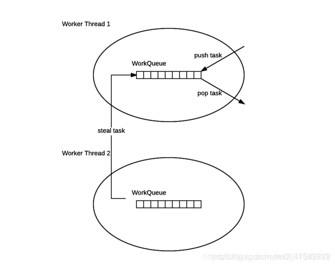

#### 有关于ForkJoinPoll的结论
ForkJoinPool不是为了替代ExecutorService,而是它的补充，在某些场景下，性能比ExecutorService更好

ForkJoinPool主要用于实现"分而治之"的算法，特别是分治之后的递归调用函数，例如快排。

ForkJoinPool最适合的计算密集型的任务，如果存在I/O、线程间同步，sleep()等可能会造成线程长时间阻塞的情况时，最好配合使用ManagedBlocker。

 


上图为forkJoinPool的工作模式--workStealing

```
 forkJoinPool的每个工作线程都维护这一个工作队列，这是一个双端队列，里面存放的对象是任务。
 
 每个工作线程在运行中产生的新的任务（是因为调用了fork()）时，对放入工作队列的队尾，并且工作线程在处理自己的工作队列时，使用的是LIFO(后进先出)
 
 每个工作线程在处理自己的工作队列的同时，会尝试窃取一个任务（或是来自于刚刚提交的pool任务，或是来自于其他工作线程的工作队列）,
 窃取的任务位于其他线程的工作队列的队首，也就是说，工作线程在窃取其他工作线程的任务是，使用的是FIFO方式。
 
 在遇到Join时，如果需要join的任务尚未完成，则会先处理其他任务，并等待期完成
 
 在既没有自己的任务，也没有可以窃取的任务是，会进入休眠状态
```
